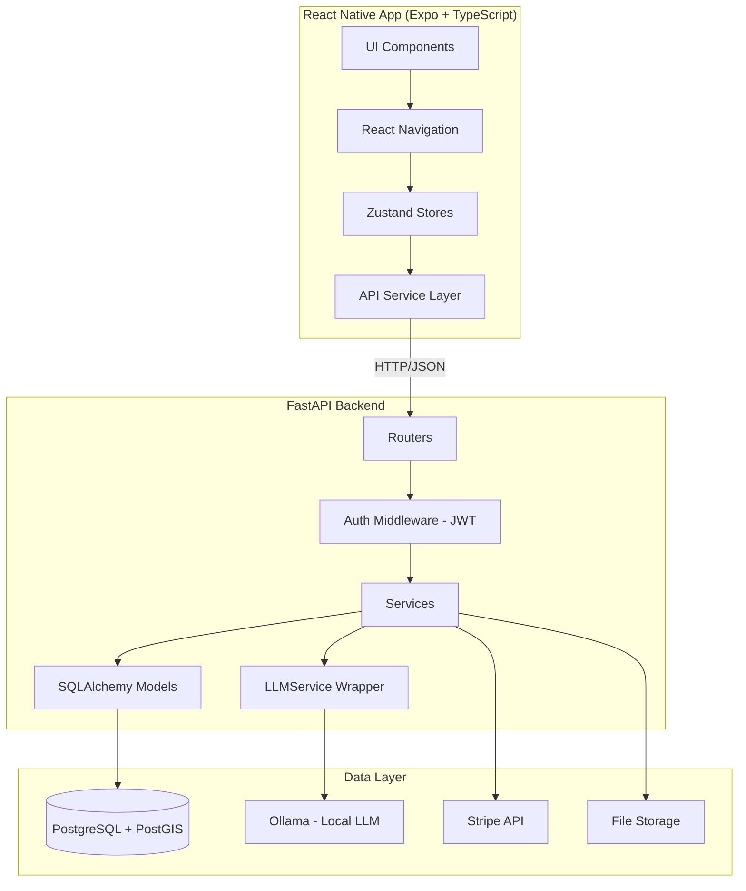
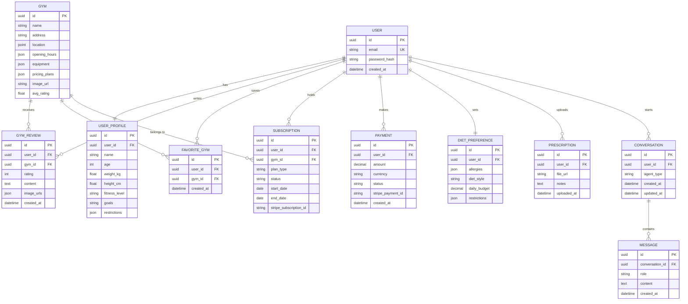
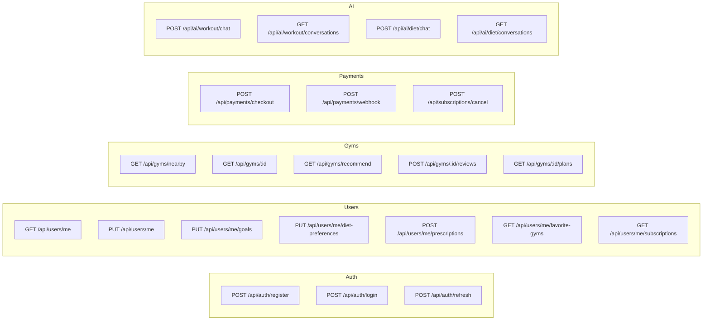
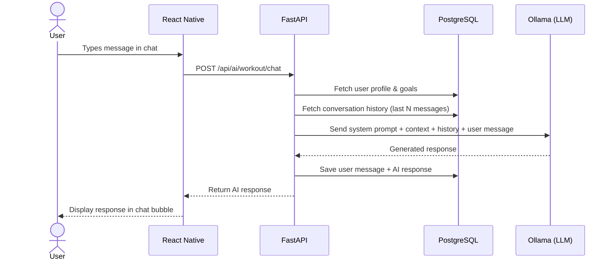
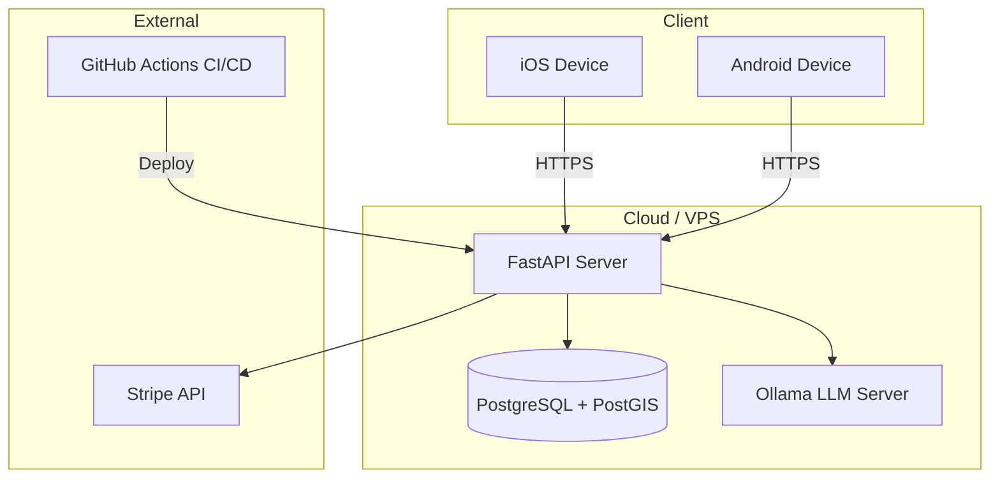

# Architecture & Diagrams

[← Back to README](../README.md)

TBD: UML diagrams, arhitectural component diagrams, workflows, ER diagrams, API endpoint diagrams, etc

---

## System Architecture



---

## Entity-Relationship Diagram



---

## API Endpoints Overview



---

## AI Agent Workflow



---

## Deployment Diagram



---

## Directory Structure

```
# 📁 Project Structure

```text
FitPlus-main/
├── .env.example
├── .gitignore
├── CLAUDE.md
├── README.md
├── docker-compose.yml
│
├── backend/
│   ├── .env.example
│   ├── Dockerfile
│   ├── alembic.ini
│   │
│   ├── alembic/
│   │   ├── env.py
│   │   ├── script.py.mako
│   │   └── versions/
│   │
│   ├── app/
│   │   ├── __init__.py
│   │   ├── main.py
│   │   │
│   │   ├── api/
│   │   ├── core/
│   │   ├── data/
│   │   ├── models/
│   │   ├── schemas/
│   │   └── services/
│   │
│   ├── scripts/
│   │   └── seed_gyms.py
│   │
│   ├── tests/
│   │   ├── conftest.py
│   │   ├── test_ai_core_helpers.py
│   │   ├── test_label_parser.py
│   │   ├── test_nutrition.py
│   │   └── test_reviews_favorites.py
│   │
│   ├── fix_db.py
│   ├── pytest.ini
│   └── requirements.txt
│
├── mobile/
│   ├── .env.example
│   ├── .gitignore
│   ├── App.tsx
│   ├── app.json
│   ├── babel.config.js
│   ├── index.ts
│   ├── package.json
│   ├── package-lock.json
│   ├── tsconfig.json
│   │
│   ├── assets/
│   │   ├── adaptive-icon.png
│   │   ├── favicon.png
│   │   ├── icon.png
│   │   └── splash-icon.png
│   │
│   └── src/
│       ├── components/
│       ├── constants/
│       ├── hooks/
│       ├── navigation/
│       ├── screens/
│       ├── services/
│       ├── store/
│       ├── tests/
│       ├── types/
│       └── utils/
│
└── docs/
    ├── ai_tools_report.md
    ├── arhitecture.md
    ├── backlog.md
    ├── contributing.md
    ├── pgadmin_docker_setup.md
    ├── run_project_guide.md
    ├── task_distribution.md
    │
    └── tasks/
        ├── member1.md
        ├── member2.md
        ├── member3.md
        ├── member4.md
        └── member5.md
```

## 🏗️ Architecture Overview

- **Backend:** FastAPI + SQLAlchemy + Alembic
- **Mobile:** React Native (Expo) + TypeScript
- **Database:** PostgreSQL with Alembic migrations
- **Containerization:** Docker + Docker Compose
- **Testing:** Pytest + Mobile test suite
- **Documentation:** Stored inside `/docs`
```
